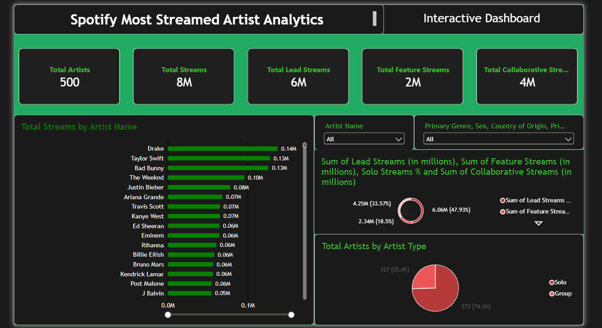
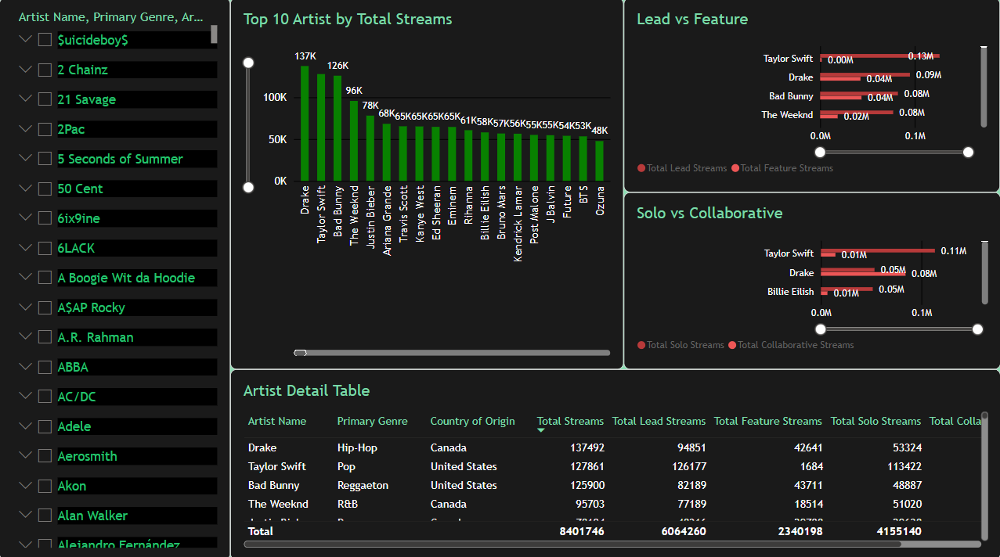
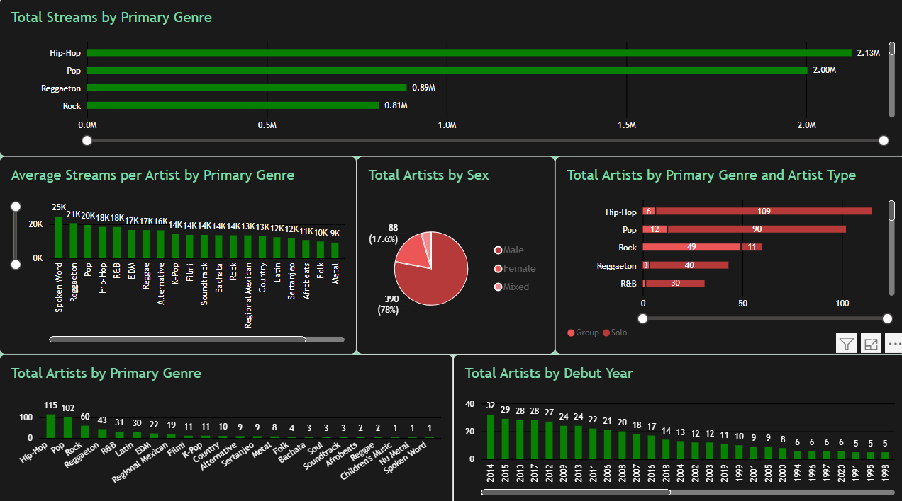
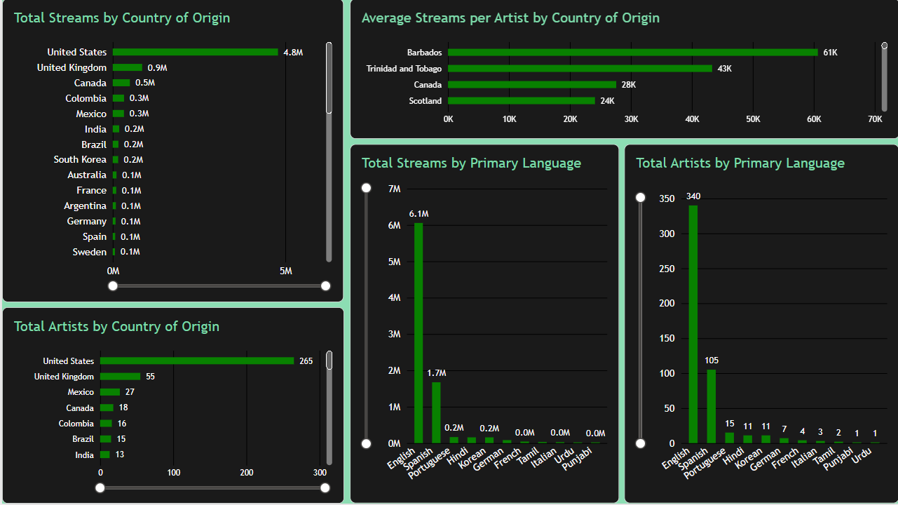

# Spotify Most Streamed Artist Analytics


## Overview

This project analyzes Spotify streaming data to explore artist performance,
music genres, artist demographics, geographic distribution, languages, and
streaming patterns.

The analysis was developed using Microsoft Power BI to transform raw music
data into an interactive analytical dashboard.

The dashboard provides multiple perspectives for understanding which artists,
genres, countries, and languages contribute to streaming activity.

---

## Dashboard Preview

### Overview Dashboard



### Artist Analysis



### Genre & Demographic Analysis



### Geographic & Language Analysis



---

## Key Metrics

| Metric | Value |
|---|---:|
| Total Artists | 500 |
| Total Streams | 8M |
| Total Lead Streams | 6M |
| Total Feature Streams | 2M |
| Total Collaborative Streams | 4M |

---

## Objectives

The main objectives of this project are:

- Identify the artists with the highest total streams.
- Analyze streaming performance by music genre.
- Compare lead and feature streaming activity.
- Analyze solo and collaborative artists.
- Explore the geographic distribution of artists.
- Analyze streaming patterns by country of origin.
- Examine streaming activity across different languages.
- Analyze artist demographics and artist types.
- Explore the relationship between artist debut year and artist representation.

---

## Business Questions

This dashboard was designed to answer questions such as:

1. Which artists have the highest total streams?
2. Which music genres generate the most streams?
3. How do lead streams compare with feature streams?
4. How significant are collaborative streams compared with solo streams?
5. Which countries have the largest number of artists?
6. Which countries generate the highest total streams?
7. Which languages are most represented among the artists?
8. Which languages contribute the highest streaming volume?
9. How are artists distributed by gender?
10. How does artist distribution vary across genres and artist types?
11. How does the number of artists vary by debut year?

---

## Key Analysis

### 1. Top Artists by Total Streams

The dashboard compares artists based on their total streaming activity.

The highest-ranked artists in the dashboard include:

- Drake
- Taylor Swift
- Bad Bunny
- The Weeknd
- Justin Bieber

The visualization allows users to compare streaming performance across
different artists.

---

### 2. Lead vs Feature Streams

The dashboard compares streams generated as the primary/lead artist with
streams generated through featured appearances.

This provides a different perspective on artist performance by separating
streams associated with an artist's own releases from streams associated with
featured collaborations.

---

### 3. Solo vs Collaborative Streams

The analysis compares solo streams with collaborative streams.

This helps examine the contribution of collaborations to an artist's overall
streaming activity.

---

### 4. Streaming by Primary Genre

The dashboard analyzes total streams across primary music genres.

The largest streaming volumes in the dashboard are associated with:

- Hip-Hop
- Pop
- Reggaeton
- Rock

Hip-Hop and Pop account for the largest portions of the displayed streaming
volume.

---

### 5. Average Streams per Artist by Genre

In addition to total streams, the dashboard calculates the average streams per
artist for each primary genre.

This provides a different perspective from total streaming volume because
genres with fewer artists can still have relatively high average streams per
artist.

---

### 6. Artist Demographics

The dashboard analyzes the distribution of artists by sex.

It also provides a breakdown of artist types across different primary
genres, allowing comparisons between solo and group artists.

---

### 7. Geographic Analysis

The dashboard analyzes both:

- Total streams by country of origin
- Total artists by country of origin

The United States represents the largest number of artists in the displayed
dataset and also accounts for the highest total streaming volume.

---

### 8. Language Analysis

The dashboard compares:

- Total streams by primary language
- Total artists by primary language

English represents the largest language category in both artist count and
streaming volume within the displayed dataset.

Spanish represents the second-largest category in the displayed
visualizations.

---

### 9. Artist Debut Year

The dashboard analyzes the number of artists by debut year.

This provides an overview of how artists in the dataset are distributed
across different periods of musical activity.

---

## Dashboard Features

The Power BI dashboard contains several interactive analytical components:

- KPI cards
- Artist filters
- Genre filters
- Country filters
- Interactive bar charts
- Comparative charts
- Pie charts
- Detailed artist table
- Streaming metrics
- Geographic analysis
- Language analysis
- Debut-year analysis

Users can interact with filters to explore specific subsets of the dataset.

---

## Data Analysis Process

The project follows a typical data analysis workflow:

```text
Raw Dataset
     ↓
Data Preparation
     ↓
Data Cleaning
     ↓
Data Transformation
     ↓
Exploratory Analysis
     ↓
Data Modeling
     ↓
DAX Measures
     ↓
Data Visualization
     ↓
Interactive Dashboard
     ↓
Insights
